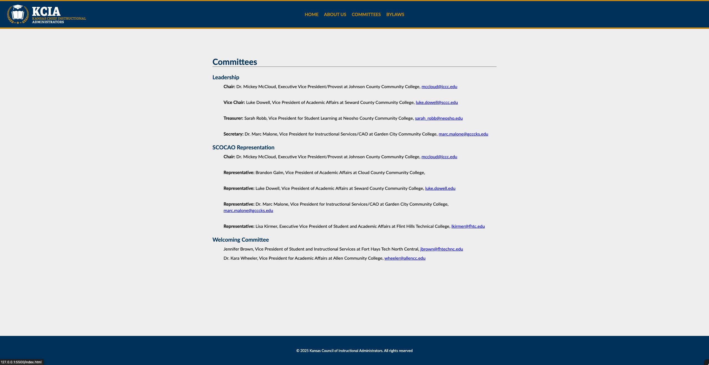
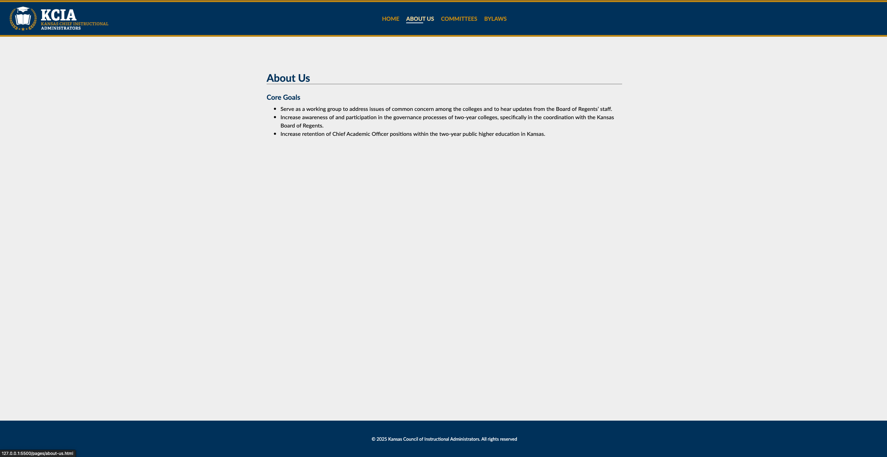

# KCIA

<!-- Add license badge below -->

 

## Description

The Kansas Council of Instructional Administrators (KCIA) website is an informational platform for Chief Academic Officers from public, two-year community and technical colleges in Kansas. The site provides details about KCIA’s mission, vision, and role in supporting and improving the Kansas higher education system. Users can learn about the organization, its committees, bylaws, and upcoming events. The website is designed for easy navigation and accessibility, offering a central resource for members and stakeholders interested in the governance and coordination of two-year colleges across Kansas.

## Table of Contents

- [Link](#link)
- [ScreenShot](#screenshot)
- [Installation](#installation)
- [Usage](#usage)
- [Credits](#credits)
- [License](#license)
- [Badges](#badges)
- [API](#api)

## Link

Below are links to the deployed app and the repo: 
[KCIA](https://garciajv86.github.io/KCIA/) 
[Project Repo](https://github.com/garciajv86/KCIA)

## ScreenShot

Website Screenshots:
 

## Installation

No Installation Needed

## Usage

To use the KCIA website, simply visit the homepage in your web browser. The site is fully responsive and can be accessed from desktop, tablet, or mobile devices. Use the navigation menu to explore information about KCIA, including its mission, committees, bylaws, and upcoming events. On smaller screens, tap the hamburger menu in the top right to open or close the navigation links. No account or installation is required—just browse and access the resources you need.

## Credits

- Joshua V. Garcia

- [My GitHub Profile](https://github.com/garciajv86)

## License

 
This project is protected under the [MIT](https://choosealicense.com/licenses/mit/) License.

## Badges

## API

No API's used for this project
